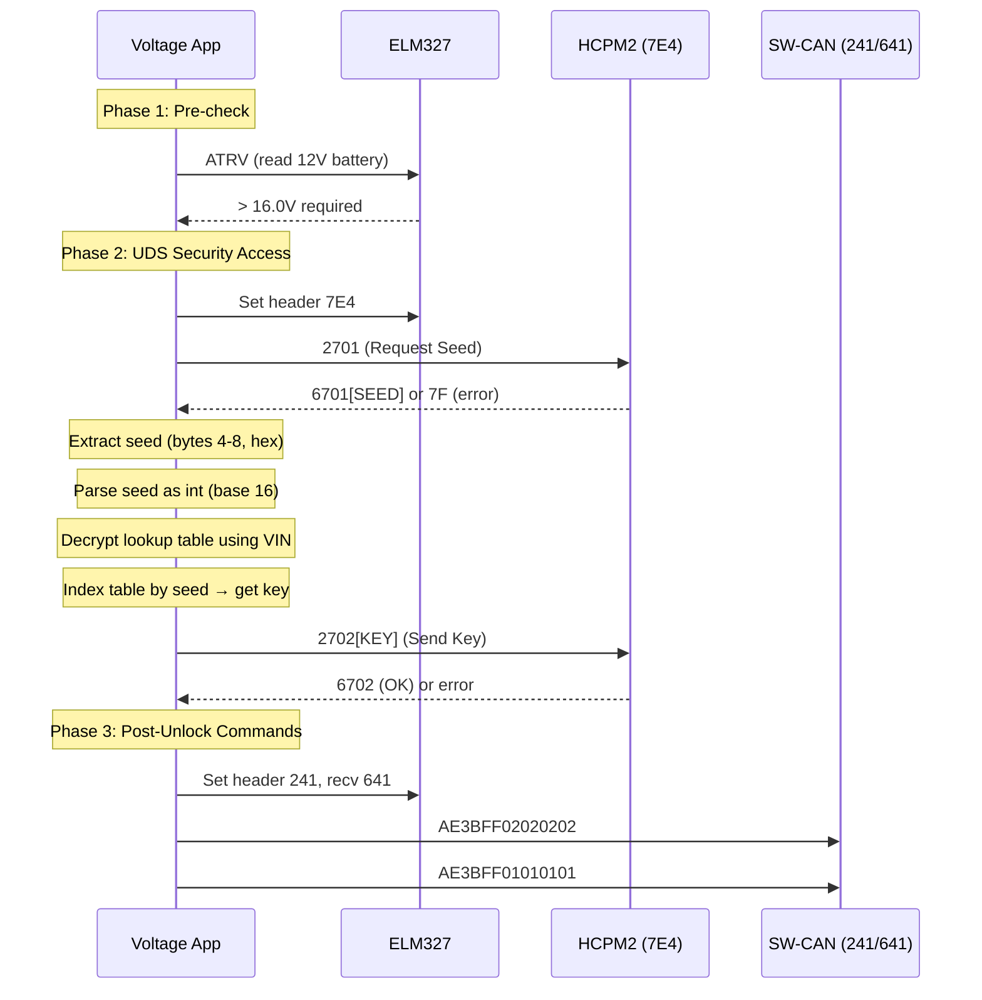

# HV Battery Unlock — Deep Analysis

## Overview

**Function:** "HV battery Unlock" button in `AdvancedControlFragment`
**Handler:** `c4.1/d.smali` → calls `W3/l.C0()` (main unlock), then `W3/l.V()` and `W3/l.W()`

The unlock involves **3 distinct phases**:



---

## Phase 1: Pre-check (`c4.1/d.smali`)

Before the unlock, the app checks battery voltage:

```
ATRV → parse voltage → must be > 16.0V
```

> [!WARNING]
> If battery < 16V, the app displays an error and **refuses to proceed**. This means the car must be ON (HV system active, 12V charging).

---

## Phase 2: Seed/Key Algorithm (`W3/l.U0()` + `n4.1/m.a()`)

### Step 1: Request Seed

```
Header: 7E4 (HCPM2)
Send: 2701 (UDS Security Access - Request Seed, level 1)
```

### Step 2: Parse Response

| Response starts with | Action |
|---|---|
| `7F` | Throw `"Seed not received"` |
| `67` | Extract seed from substring(4, 8), parse as hex int |

### Step 3: Derive Key (⚠️ THE KEY ALGORITHM)

This is the critical part. The app uses a **VIN-based encrypted lookup table**:

```
key = lookupTable[ seedValue ]
```

The lookup table itself is **AES-encrypted** and stored in `n4.1/k.n` (a massive Base64 string). The decryption works as follows:

#### `n4.1/m.a(encryptedBase64, password)`:

```
1. Base64-decode encryptedBase64 → raw bytes
2. Split raw bytes:
   - bytes[0:8]   → IV for AES
   - bytes[8:24]  → Salt for PBKDF2
   - bytes[24:]   → AES ciphertext
3. Key derivation:
   - Algorithm: PBKDF2WithHmacSHA256
   - Password:  VIN (lowercased, as char array)
   - Salt:      bytes[8:24]
   - Iterations: 65536 (0x10000)
   - Key length: 256 bits
4. Decrypt:
   - Algorithm: AES/CBC/PKCS5Padding
   - Mode:      Decrypt (mode 2)
   - Key:       derived from step 3
   - IV:        bytes[0:8]
5. Result → UTF-8 string
```

#### Password source

The password is derived from the VIN via `n4/k.n` field, which is the encrypted table. The VIN itself is read as `n4/k.n` (lowercased via `L4/c.G0()`).

> [!IMPORTANT]
> The lookup table key is labeled `"tanya"` in the code. This is the VIN (lowercased), split by `"L"` delimiter, and indexed by the seed value to produce the matching key.

### Step 4: Submit Key

```
Send: 2702 + key (UDS Security Access - Send Key)
```

| Response | Action |
|---|---|
| Starts with `6702` | ✅ Unlock success |
| Other | ❌ Throw `"Wrong key: [response]"` |

---

## Phase 3: Post-Unlock Commands (`W3/l.V()` + `W3/l.W()`)

After successful unlock, two GM-proprietary commands are sent on **SW-CAN** (headers `241`/`641`):

### V() — Step 1:
```
Set header: 241
Set recv:   641
Send:       7E (tester present?)
Send:       AE3BFF02020202 (GM service: unlock HV contactors?)
```

### W() — Step 2:
```
Set header: 241  
Set recv:   641
Send:       AE3BFF01010101 (GM service: activate HV?)
```

---

## Comparison with SHVCS.NET

| Aspect | Voltage 2.1.1 | SHVCS.NET |
|--------|---------------|-----------|
| **Seed request** | `2701` on `7E4` | `022701` on `7E4` |
| **Key derivation** | VIN → PBKDF2 → AES-decrypt lookup table | Manual user input |
| **Key submission** | `2702 + computed_key` | `042702[user_key]` |
| **Post-unlock** | `AE3BFF02020202/01010101` on SW-CAN | `07AEFC0200004600` on HS-CAN |
| **Target** | SW-CAN contactors (241/641) | HCPM2 DTC clear (7E4/7EC) |
| **Purpose** | Unlock HV battery contactors | Clear SHVCS DTCs |

> [!CAUTION]
> **Different goals!** Voltage's "HV Unlock" is about **unlocking HV battery contactors** (physical relay control), while SHVCS.NET clears **DTCs from HCPM2**. Both share the same seed/key step on `7E4`, but diverge after unlock.

## Key Takeaway

The seed/key algorithm is **VIN-specific and encrypted**. Voltage pre-computes all possible keys for each VIN and encrypts them with AES using the VIN as the password. This means:

1. **You cannot derive the key from the seed alone** — you need the VIN-specific lookup table
2. The lookup table is **baked into the app** and encrypted per-VIN
3. SHVCS.NET takes a different approach: it asks the **user to input the key manually**
4. The key algorithm itself appears to be a GM-proprietary security scheme where each VIN has a fixed set of seed→key mappings
